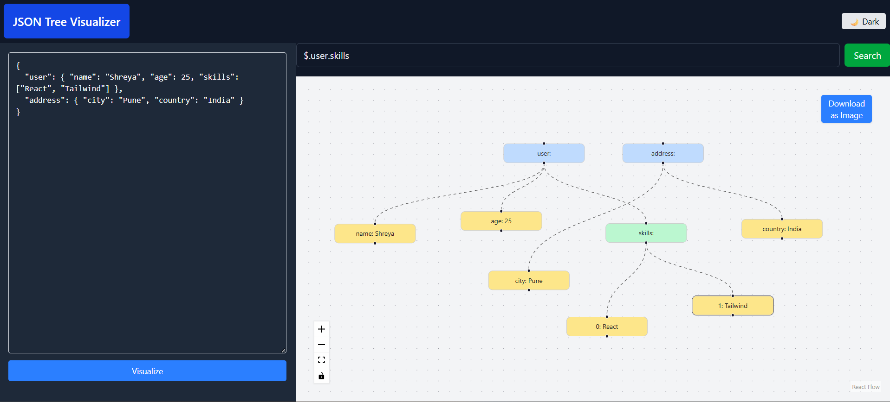

# 🌳 React Tree Visualizer

A simple and interactive **Tree Visualizer** built using **React Flow**, **Tailwind CSS**, and **React**.  
Visualize any JSON-like hierarchical data structure as a connected tree, **search** through nodes, **toggle themes**, and **download** the visualization as an image.

---

## 🚀 Features

- 📊 **Tree Visualization** using React Flow  
- 🔍 **Search Node** with smooth zoom & highlight  
- 🌗 **Light / Dark Theme Toggle**  
- 📸 **Download Visualization** as PNG (includes nodes + edges)  
- ⚡ **Built with Tailwind CSS** for minimal & clean styling  
- 🧩 **Dynamic Node Generation** from nested JSON  

---

## 🧠 How It Works

1. The tree structure is generated **dynamically** from nested JSON data.  
2. Each **key/value pair** is represented as a **node**, connected through **edges**.  
3. You can **search** for any node name — if found, it smoothly pans and highlights it.  
4. The **Theme Toggle** button lets you switch between **Light** and **Dark** modes.  
5. Click the **Download** button to save the current visualization (including edges) as an **image**.  

---

## 🛠️ Tech Stack

- ⚛️ **React 18+**  
- 🌊 **React Flow** for graph visualization  
- 🎨 **Tailwind CSS** for styling  
- 🖼️ **html-to-image** for image download feature  

---

## 📸 Preview

> https://json-tree-visualizer-nu.vercel.app/
> 

---

## ⚙️ Installation & Setup

```bash
# Clone the repository
git clone https://github.com/shreyk04/react-tree-visualizer.git

# Navigate to the project directory
cd react-tree-visualizer

# Install dependencies
npm install

# Start the development server
npm run dev
